# Crash
The repository for the Savage Rhinoceroses capstone team

## Table of Contents
- [**Crash**](#crash)
  - [**Table of Contents**](#table-of-contents)
  - [**Application overview**](#application-overview)
  - [**Use cases**](#use-cases)
      - [**Getting on the right bus**](#getting-on-the-right-bus)
      - [**Getting off at the right bus stop**](#getting-off-at-the-right-bus-stop)
  - [**Preventing failure**](#preventing-failure)

## Application overview

Prior to using our app, the user is expected to do their trip planning on a separate navigation app such as Google Maps which will provide them with the following needed information: bus number, bus direction, origin bus stop, destination bus stop. The user should also turn off their WiFi in order to prevent data loss when leaving an area with WiFi. Once they have this information, the user is ready to use OneBuzzAway.

The user will first begin by seeing this screen, and as it says, tapping anywhere will get them started.

Then, the user will need to enter their bus number and choose in which direction they want to go.

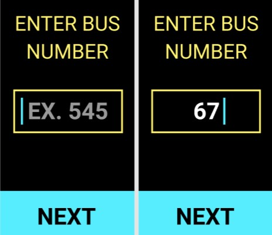

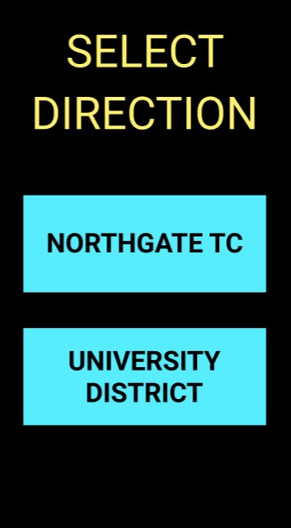

Please note that in the case where there are multiple routes that belong to the entered bus number, a page would show prior to selecting a direction where the user has to choose which bus route they want to take.

Once a bus route and a direction have been selected, the user will be provided with origin and destination stops the user will choose from. For the origin stop selection, there are two options depending on the settings the user has set on their phone.

1. If the user has their location services on, the app will show the top 3 nearby stops to the user’s current location and a 4th option to send the user to all the stops in case their desired stop is not listed. 

    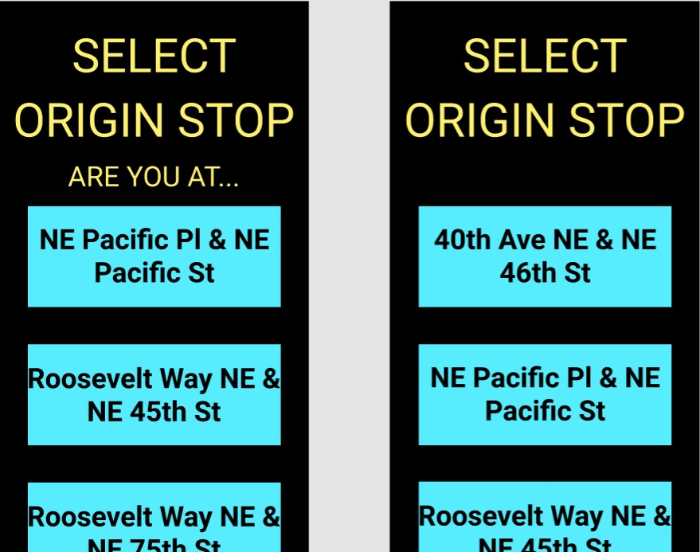

1. If the user’s location services is off, the app will show all of the stops available for the selected bus route and direction. 

    

For the final stop selection, the user will be offered with all of the stops from the origin stop selected until the last stop available for that route. 

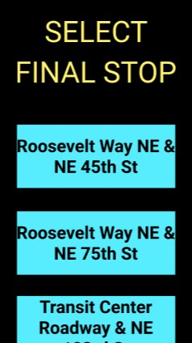

As can be seen, the bus routes, directions, and stop names are quite long. And so, the user is able to rotate the screen in any way they would like in order for the text to become easier to read.

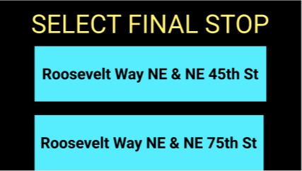

Once the user is finished entering their information, they will get a confirmation page to ensure one last time that their selected bus route and stops are what they meant to choose.

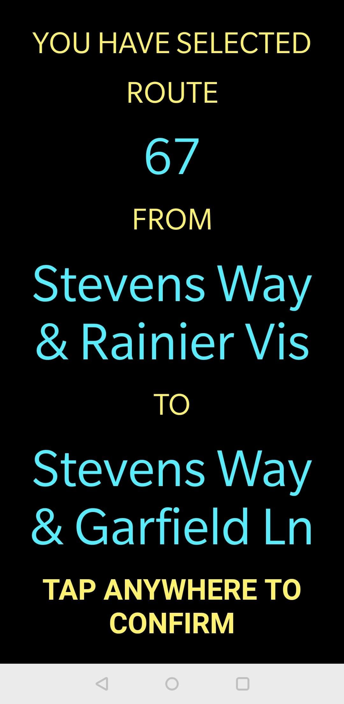

Then, they will wait for their bus to show. The user will know that their bus is almost at the bus stop when there is a buzzing alert. 
As soon as they feel the alert, the user is asked to tap anywhere on the screen which will lead to the following view:

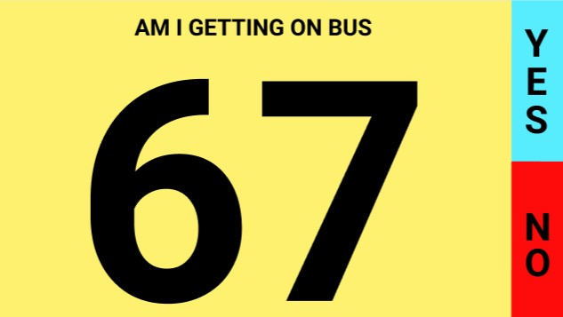

Please note that the screen is yellow, which represents the identity of a non-hearing individual. This means that the bus driver will make contact with the user by touch. 

If the user is comfortable, they will hold their phone with the screen facing away from them so that bus drivers can look out for this sign and help the user on the bus. As the bus driver confirms/rejects that the user is getting on the right bus, the button selection will lead to two buzzing - yes will have 1 buzz while no will have 2. If the bus driver presses yes, they will get a confirmation page to ensure it was not selected by accident and prevent errors. 

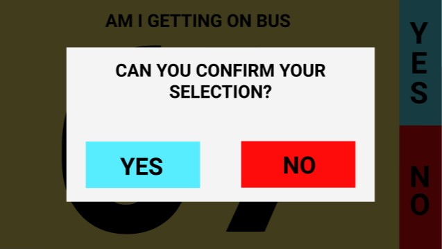

The same buzzing pattern for yes and no selection will show in this screen as well. 

From this screen on out, the bus’ location will be tracked as it goes from one stop to another so that the user knows exactly how far away they are and when to get off. 

When the user is 2, 1, or 0 stops away, they should expect different buzzing to represent each of those cases. 2 stops away would mean 2 buzzes, 1 stop away would mean 1 buzz and 0 stops away would cause a never ending buzz until the user stops it by tapping anywhere on the screen.

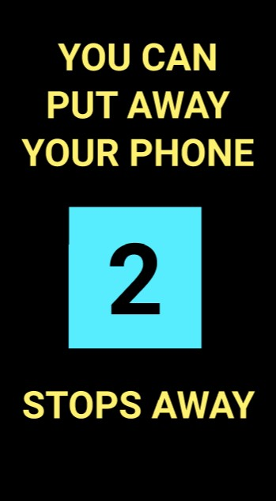 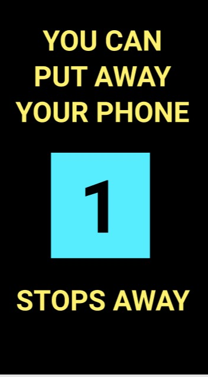 

## Use cases

### Getting on the right bus

The user wants to get on the right bus easily, and independently. In order to get on the right bus, the user first has to enter their trip information based on their trip planning done in a separate navigation app. They enter their route number, direction, origin stop, and final stop.

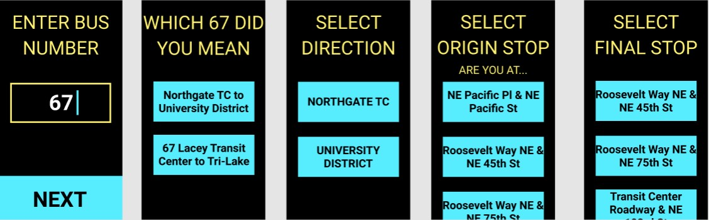

The user also sees a confirmation screen that they tap to select.

Then, the user prepares for the bus arrival. They can keep their phone in their hand, their jean pocket, or their jacket pocket. The phone will buzz when the bus is close to arrival so the user has time to prepare.

Once the bus arrives the user takes out their phone, clicks on the screen and then has the following screen facing away from them.

At this point, there can be further two cases. If the user still has some vision, they are likely to get on the bus on their own. They will show the screen above to the driver so he can confirm that the user is on the right bus. However, if the user is completely blind, the user will hold this screen up at the bus stop and wait for the bus driver to tap on the screen to confirm.

For the first case that the user has some vision, if they accidentally get on the wrong bus (which they will know through the driver pressing “no” and the phone buzzing), they can get off the bus and wait again. For the second case, if the user’s bus has not arrived yet, no action would be happening to the screen so the user would know their bus has not arrived yet. In either way, the user does not get on the wrong bus.

Once the right bus arrives, however, the driver will press yes in both cases and the user will either take a seat on their own, or the bus driver would help them on the bus.

### Getting off at the right bus stop

The user wants to get off at the correct bus stop and wants to make sure that they have a reliable, stress free way to keep track of where they are in their route.
Once the user gets on the correct bus, the following screen shows up:

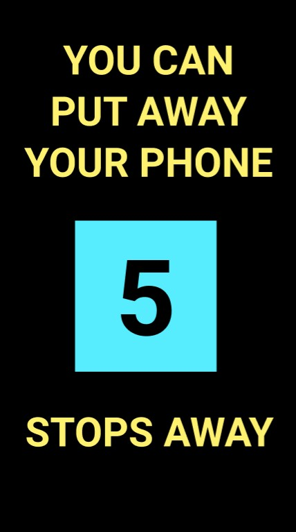

They sit down and keep their phone in their hand, in their jean pocket, or their jacket pocket. As the bus goes through each stop in the route, the number on the screen decrements.

While on the bus, the user could be doing different activities such as talking, drinking water, eating a snack all of which may distract and thus prevent them from getting off at the right stop. And so, the user is not worried because when they are 2 stops away they get a vibration to let them know they need to get ready to get off. They get another alert like this when they are 1 stop away. Once they arrive at their bus, the vibration will go off indefinitely and the user will stop the vibration by tapping on the screen.

Therefore, regardless of where they sit or what they are doing, the user will still remember to get off at their desired final destination.

## Preventing failure

The following failure cases are under the assumption that the user follows the flow of the application:

- In case of phone dying, all information is lost. In order to prevent this case from happening, the user should leave the house with as much battery as possible and if possible, a wireless charger in case of battery outage.
 
- In case of phone losing service, only once the service is back, the user’s process on the application restarts; meaning they have to re-enter their information.

- In the case that the OneBusAway api is off, the user may be getting off a little early or a little after their desired stop and they will need to find their way to their destination.

- In the case of not feeling the buzz when the bus approaches, the user might miss the bus and need take catch the next one.

- In the case of not feeling the buzz when the destination stop approaches, the user might miss their stop and get off a couple of stops late.

- In the case of the bus driver not seeing the phone display of the bus route the user needs, the bus might pass by without helping the user onto the bus. To mitigate this problem, the service should be well explained in training to the bus drivers.
